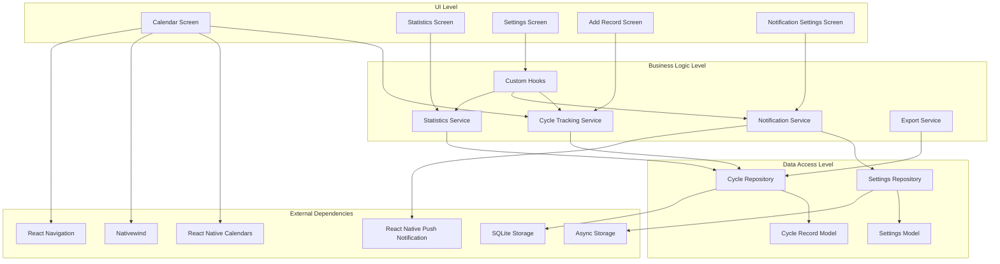

# Диаграмма архитектуры приложения - Этап 1

## Пояснение к диаграмме

### UI Level (Уровень представления)
- **Calendar Screen**: основной экран с календарем для отображения и взаимодействия с днями цикла
- **Statistics Screen**: экран для отображения статистики и аналитики цикла
- **Settings Screen**: экран для настройки параметров приложения
- **Add Record Screen**: экран для добавления и редактирования записей о цикле
- **Notification Settings Screen**: экран для настройки параметров уведомлений

### Business Logic Level (Уровень бизнес-логики)
- **Cycle Tracking Service**: сервис для управления записями о цикле, расчета продолжительности и прогнозирования
- **Notification Service**: сервис для управления уведомлениями и их планирования
- **Statistics Service**: сервис для вычисления статистических данных и генерации отчетов
- **Export Service**: сервис для подготовки данных к экспорту
- **Custom Hooks**: пользовательские хуки для управления состоянием и взаимодействия с сервисами

### Data Access Level (Уровень доступа к данным)
- **Cycle Repository**: репозиторий для операций с записями о цикле
- **Settings Repository**: репозиторий для операций с настройками приложения
- **Cycle Record Model**: модель данных для записи о дне цикла
- **Settings Model**: модель данных для настроек приложения

### External Dependencies (Внешние зависимости)
- **React Native Calendars**: библиотека для реализации календаря
- **React Native Push Notification**: библиотека для реализации уведомлений
- **Nativewind**: библиотека для стилизации компонентов
- **React Navigation**: библиотека для навигации между экранами
- **SQLite Storage**: библиотека для локального хранения данных
- **Async Storage**: библиотека для хранения настроек